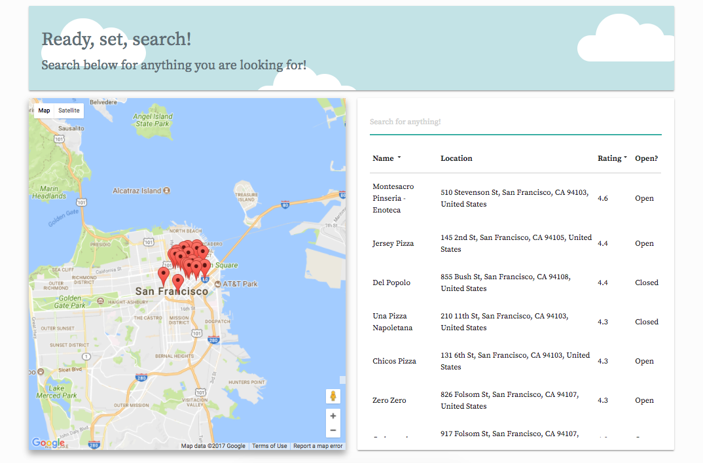

# Google Maps Project

This application uses Google Map and Google Places to search for and display places based on search.

## Getting Started

### Prerequisities

Be sure to grab a Google Maps API key from https://developers.google.com/maps/

### Installing

```
npm install
```

Inside index.html, be sure to add your API key to the following script tag inside index.html and testRunner.html:

```
<script src="https://maps.googleapis.com/maps/api/js?key=KEYHERE&libraries=places"></script>
```
Then:

```
open index.html
```

## Running Tests

```
npm run test
```

## Layout

* [js/places.js](https://github.com/joeylaguna/googleMapsProject/blob/master/js/places.js) - Main JS file.  Contains functions that build the search result list and DOM manipulation.

* [js/googleMapUtils.js](https://github.com/joeylaguna/googleMapsProject/blob/master/js/googleMapUtils.js) - Google Maps/Places Utility functions files.  Contains all the functions needed to build the map and handle places searches.

* [js/sorting.js](https://github.com/joeylaguna/googleMapsProject/blob/master/js/sorting.js) - Sorting file.  Contains functions that sorts search results by either rating or name.  By default, search results will display in descending order by rating.

## Built With

* [Google Maps/Places](https://developers.google.com/maps/) - Google Maps and Places used to display map and search results
* [Materialze CSS](http://materializecss.com/) - CSS framework used for basic grid/card setup